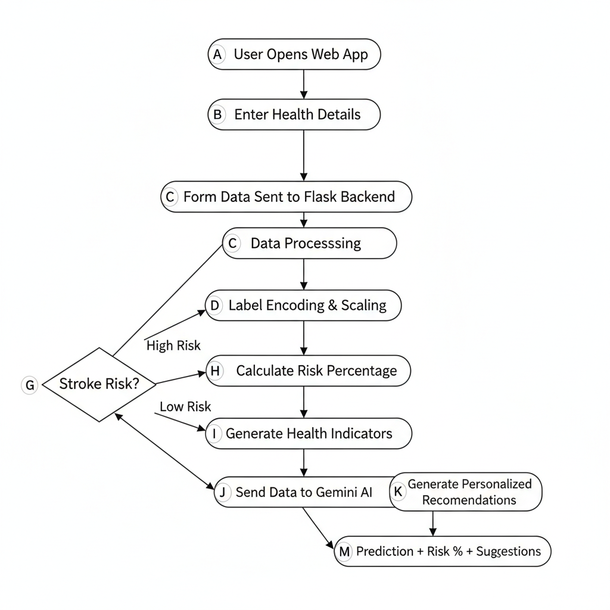

# ❤️ HeartCureAI

## Overview
**HeartCureAI** is a machine learning–powered application that predicts the risk of heart stroke based on user-provided medical parameters. The project focuses on early risk assessment and demonstrates the practical use of AI in the healthcare domain.

It integrates a trained ML model with a simple web interface, allowing users to input health details and receive instant predictions.

---

## Problem Statement
Heart stroke is one of the leading causes of death worldwide. Many cases can be prevented through early detection, but:
- Early symptoms are often ignored  
- Medical diagnosis can be time-consuming  
- There is a lack of accessible tools for preliminary risk analysis  

HeartCureAI aims to address these challenges using data-driven prediction.

---

## Solution
HeartCureAI uses machine learning algorithms trained on historical health data to analyze critical medical parameters and predict whether a person is at risk of a heart stroke.

The system provides:
- Quick predictions  
- Easy-to-use interface  
- Awareness-driven results  

---

## flowchart

  

## Tech Stack

### Programming Language
- **Python** - Core language used for model development, backend logic, and integration

---

### Machine Learning & Data Science
- **Scikit-learn** – Model training, preprocessing, and prediction  
  - RandomForestClassifier  
  - StandardScaler  
  - LabelEncoder  
- **Pandas** – Data manipulation, preprocessing, and feature handling  
- **NumPy** – Numerical computations  
- **Joblib** – Saving and loading trained ML models, scalers, and encoders  

---

### Model & Algorithm
- **Random Forest Classifier**
  - Used for heart stroke risk classification
  - Robust against overfitting
  - Handles non-linear relationships effectively

---

### Backend Framework
- **Flask**
  - Handles routing and server-side logic
  - Manages form data and prediction requests
  - Connects ML model with frontend UI

---

### Frontend Technologies
- **HTML** – Structure of web pages  
- **CSS** – Styling and layout  
- **JavaScript** – Client-side interactions  

---

### AI Integration
- **Google Gemini API (gemini-1.5-pro)**
  - Generates personalized health recommendations
  - Provides lifestyle, diet, activity, and prevention suggestions
- **google-generativeai** – Python SDK for Gemini API  

---

### Environment & Configuration
- **python-dotenv**
  - Manages sensitive environment variables
  - Secures API keys (Gemini API Key)

---

### Development & Deployment
- **Virtual Environment (recommended)**  
- **Git & GitHub** – Version control and project hosting  

---

### Model Artifacts
- Trained Model: `stroke_model.pkl`  
- Scaler: `scaler.pkl`  
- Label Encoders: `label_encoders.pkl`  
- Feature Order: `feature_names.pkl`  

---

## Dataset
- Public heart disease dataset
- Includes attributes:
  - Gender
  - Age
  - Hypertension
  - Heart Disease
  - Marital Status
  - Residence Type
  - BMI
  - Smoking 
  - Alcohol Intake
  - Physical Activity
  - Stroke History
  - Family History

---

## Features
- ML-based heart stroke prediction
- Simple and responsive UI
- Fast and reliable results
- End-to-end ML pipeline
- Easy to extend and deploy

---

## Use Cases
- **Healthcare Awareness:** Helps users identify potential risks early  
- **Academic Projects:** Ideal for college projects and hackathons  
- **ML Learning:** Demonstrates real-world ML deployment  
- **Research & Analysis:** Useful for studying healthcare analytics  

---

## ⚠️ Disclaimer
This project is **for educational purposes only** and should not be considered a medical diagnostic tool. Always consult a certified healthcare professional for medical advice.

---

## Future Enhancements
- Improve accuracy using advanced models
- Add graphical health insights
- Integrate real-time health data
- Add user authentication

---

## 👥 Developers

- **Shubhrant Tripathi** – Lead Developer  
  - Machine Learning model development  
  - Backend integration using Flask  
  - AI-based recommendation system (Gemini API)  

- **Tanisha Jain** – Developer  
  - Model training and data preprocessing  
  - Feature engineering and dataset handling  
  - Backend support and testing  

---

## Support
If you find this project helpful, consider giving it a ⭐ on GitHub!
